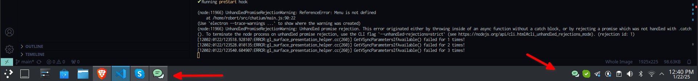
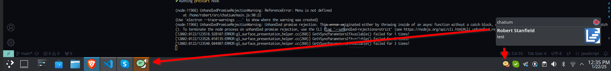

# Chatium

This web browser opens Google Chat in electron and is unofficial. This project is not associated with Google. I maintain it for my use at work, and if at any
point we stop using Google Chat, I will no longer maintain this project. I'll make an effort to resolve any issues, but no garuntees.

## Operating Systems

- Linux

## Install

Download the flatpak from the releases page under assets: https://github.com/stanfieldr/chatium/releases/latest
```bash
flatpak install com.github.chatium_stable_x86_64.flatpak
```

I have only tested the flatpak, YMMV for deb/rpm

### Normal Screenshot



### Unread Messages Screenshot



## Contributions

Feel free to open pull requests, just try to follow the coding styles already in the project.

Tip Monero: 8Ag9ar38hzsSbpa5YU7Z3phwTiPyEZvB5drMBwqbq3mYBDbsfaSnK7iYhcBDj6LJHbcMqPkaM9thWDpXmUoRUNvqVHh69TH

## Known Issues

- The app closes when you click the X button (click the tray icon as work around)
- No settings like autostart (workaround use KDE or Gnome settings to start)
- When you first start the app you need to login, a bit unintuitive (only the very first time)

## Building from source

You'll need Node.js (I'm using 21.7.1 at the time of this writing)

Debian Requirements:
```bash
sudo apt-get install -y flatpak flatpak-builder elfutils rpm
flatpak remote-add --if-not-exists --user flathub https://flathub.org/repo/flathub.flatpakrepo
```

Create the packages:
```bash
DEBUG=* npm run make
```

Install the flatpak:
```bash
cd out/make/flatpak/x86_64
flatpak install com.github.chatium_stable_x86_64.flatpak
```